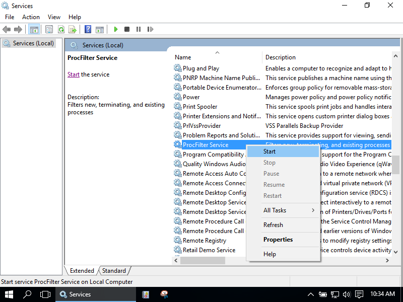
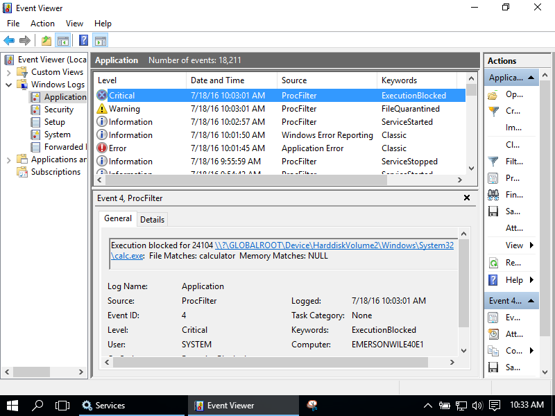
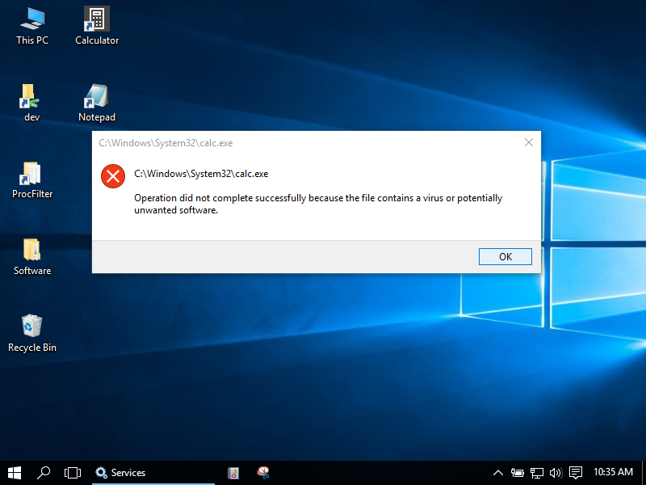
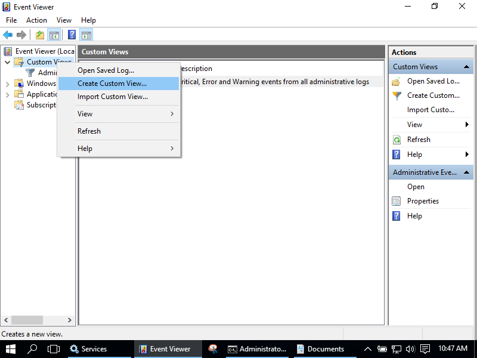
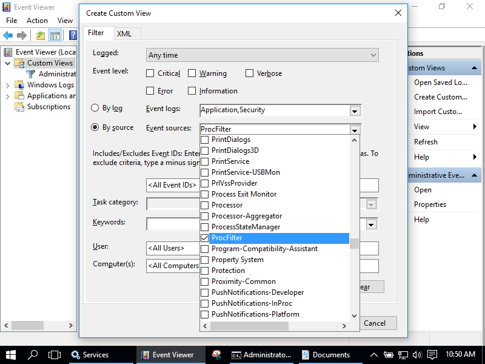
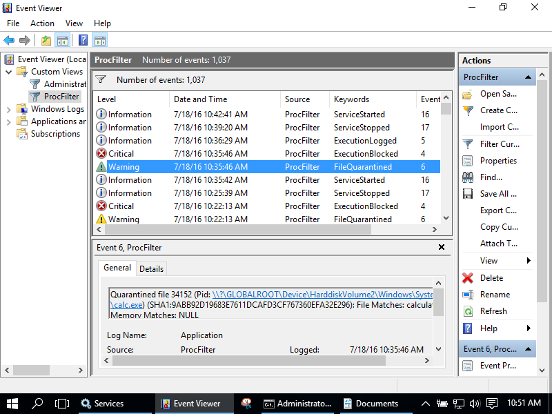
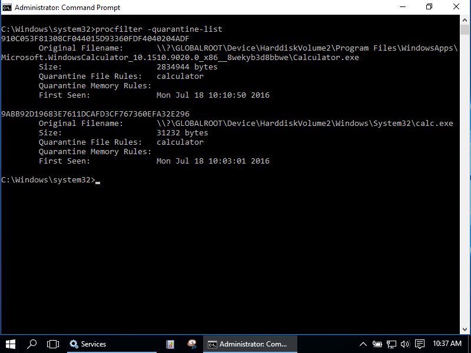
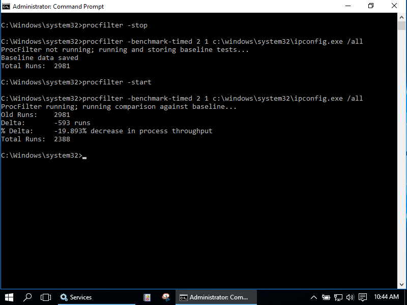

# ProcFilter

[](https://gitter.im/procfilter/procfilter?utm_source=badge&utm_medium=badge&utm_campaign=pr-badge&utm_content=badge)

ProcFilter is a process filtering system for Windows with built-in [YARA](https://github.com/virustotal/yara) integration. YARA rules can be instrumented with custom meta tags that tailor its response to rule matches. It runs as a Windows service and is integrated with [Microsoft's ETW API](https://msdn.microsoft.com/en-us/library/windows/desktop/bb968803%28v=vs.85%29.aspx), making results viewable in the Windows Event Log. Installation, activation, and removal can be done dynamically and does not require a reboot.

ProcFilter's intended use is for malware analysts to be able to create YARA signatures that protect their Windows environments against a specific threat. It does not include a large signature set. Think lightweight, precise, and targeted rather than broad or all-encompassing. ProcFilter is also intended for use in controlled analysis environments where custom plugins can perform artifact-specific actions.

Designed to be easy to adopt, ProcFilter's integration with Git and Event Log minimize the need for additional tools or infrastructure to deploy rules or gather results.

ProcFilter is compatible with Windows 7+ and Windows Server 2008+ systems.

# Installers
- [ProcFilter x86/x64 Release/Debug Installers](https://github.com/godaddy/procfilter/releases)

Note: Unpatched Windows 7 systems require [hotfix 3033929](https://technet.microsoft.com/en-us/library/security/3033929) to load the driver component. More information can be found [here](https://github.com/godaddy/procfilter/issues/1). 

# Features
+ Block/Quarantine/Log processes based on YARA rules found in a Git repository
+ Integrated with the Windows Event Log
+ Highly configurable via INI file
+ Installation/removal without rebooting
+ Built-in performance measuring and stress testing
+ Plugins extend or augment ProcFilter's behavior
+ Command-line behavior includes YARA scanning, file hashing, and service status querying

# Screenshots

ProcFilter can be controlled through the Services control panel:



New processes that match rules with `Block`, `Log`, or `Quarantine` values set are handled accordingly and results are sent to the `Event Log`'s `Application` channel with the source of `ProcFilter`:



If the process was started via the Windows GUI the user will receive a dialog box indicating creating the process failed:



The Windows `Event Log` can be customized to provide a convenient view of ProcFilter's events with the following steps:





Processes that match rules with the `Quarantine` directive set to `true` will be quarantined and can be viewed or exported via the command-line:



Performance can be measured with built-in performance testing:



ProcFilter has a variety of command-line options for convenience:


# Configuration
[procfilter.ini](https://github.com/godaddy/procfilter/blob/master/files/procfilter.ini) contains a variety of variety of configurables, including:
+ File/memory scanning on process create/terminate
+ File/memory scanning periodically
+ File/Memory scanning on executable image load

procfilter.ini also include a variety of plugin-specific options in addition.

# Project Goals

+ Allow analysts to hook in to process and thread kernel events
+ Operationalize the growing body of knowledge found in YARA signatures in the Windows environment
* Fill in the gap between detection of a threat and vendor response
+ Be a lightweight, configurable, additional layer of defense

# Project Non-Goals

+ Become an A/V replacement
* A/V does much more than ProcFilter: Behavior based detection, code emulation, centralized management, self-protection, inter-process communication and monitoring, examines file operations, examines network behavior, and many more vendor-specific features

ProcFilter could do some or all of these things in the future through plugins but these features are currently out of scope as the project is being established.

# Signatures

Signatures can either come from disk or more conveniently from a Git repository. Configuration can specify a Git URL to pull updates from and the service will automatically check out and load new commits.

By default ProcFilter will respond to 3 boolean meta tags within YARA rules:

| Meta Tag   | Action |
| ---------- | ------ |
| Block      | Block the process associated with rule matches |
| Log        | Allow the process but log its presence |
| Quarantine | Make a copy of the associated file in a quarantine location |

An example YARA rule for use with ProcFilter that matches UPX-packed binaries:

<pre>
rule upx {
    meta:
        description = "UPX packed file"
        
        <b>Block = false</b>
        <b>Log = true</b>
        <b>Quarantine = false</b>
        
    strings:
        $mz = "MZ"
        $upx1 = {55505830000000}
        $upx2 = {55505831000000}
        $upx_sig = "UPX!"

    condition:
        $mz at 0 and $upx1 in (0..1024) and $upx2 in (0..1024) and $upx_sig in (0..1024)
}
</pre>

ProcFilter comes with a small set of default rules to get analysts started.  It *does not* contain a large rule set meant to catch everything.  In fact, it only includes rules for very select few families.  [View the default rule set here](https://github.com/godaddy/yara-rules). While it is possible to include a massive rule set, consider the potential for false-positives, difficulty in rule creation, and fundamental limitations of signature-based prevention -- all-encompassing rule sets quickly become a much more difficult challenge than it may appear at the outset. See the "Advocacy for Signature Sharing" section below for more details.

Plugins can add handlers for custom meta tags.  The 'cmdline' plugin, for example, looks for ```CaptureCommandLine``` tags that trigger it to record command line options associated with rule matches. It also enables ```AskSubprocesses``` and ```LogSubprocesses``` options which will ask to allow and log new subprocesses created by the matching process. This could be used, for example, in a rule matching ```cmd.exe``` to log command shell activity.

# Jusitification and Effective Usage

ProcFilter is **not** an AntiVirus replacement. ProcFilter contains a *minimal* signature set and will miss most malware by default. Despite this it still has high utility and is a valuable component of a defense-in-depth strategy against unwanted software.

ProcFilter uses YARA and YARA is signature-based. This means that in order to block something it must have been seen before.  Signature evasion is trivial -- repack and evade -- although it does raise the bar of difficulty for an attacker since it generally follows that that the more an attacker tries to hide a payload the more prominent and detectable the hiding mechanism becomes.

Sophisticated payloads tend to be complex pieces of software and like any other complex software do not change drastically over time even though the packing might. Well-written signatures may work for longer periods of time, keying in on aspects of code unlikely to change across obfuscations, packing, or varied compilation options. Sometimes it's possible to "see through" packing as [in this example](https://github.com/godaddy/yara-rules/blob/master/emotet.yara).

Post-execution memory scanning, while resource intensive, can detect post-execution payloads. It's not preventative but it will give you visibility and awareness you wouldn't have had otherwise. Furthermore, this can be used by analysts in a controlled environment to detect payloads of packed malware without having to involve a debugger.

Legitimate software is not often packed and rules that detect packers can help identify unwanted software. You may not need to know what something is -- just that it's hiding its behavior is enough. For example, you may know that packed software should not be run in a specific, tightly-controlled environment, making ProcFilter an effective mitigation or additional indicator of unwanted behavior. Note that this is environment dependent; some legitimate software such as games use packers like UPX to compress game assets and minimize executable size.

### Signature Sharing

Signature sharing is a challenge. If signatures are publicly visible then an attacker can test against them until evasion is successful. Addtionally, the open format of YARA provides a roadmap to exactly what within a family is causing the detection. On the other hand, this consumes the attacker's resources by forcing them to adapt. Additionally, prior releases of the malware will no longer be effective once a signature has been created.

Considering the pros and cons, it's advisable to avoid subscribing to the belief of keeping security-related information private to avoid “tipping the hand to attackers”. The benefit of open information exchange is multiplicative and with that comes the ability to out scale — consider the success of software such as AdBlock. If you have a community of people with the same vested interest in solving the next new problem you’re a lot better off than if you kept your tips & tricks private and remained independent in the fight against malware.

Furthermore, consider that if signature evasion is a problem, custom-written plugins still have plenty of opportunity to perform advanced actions to detect malware. ProcFilter can be extended in many different dimensions to meet a multitude of techniques.

Pros of Sharing:
+ Promotes a community in which resources can be pooled
+ Remains effective against prior releases/deployments of a malware family
+ Reduces duplicated effort which is currently the status quo
+ Once a threat is identified, signatures can be shared across all participants
+ The larger the community defining the threats, the less damage they will be able to do

Cons of Sharing:
+ Attackers can test against public signatures until evasion is successful
+ The open format of YARA provides information as to what exactly needs to be changed to evade signatures

Sharing in a semi-open fashion between trusted partners via private forums can be an effective way to mitigate the cons of open sharing.

# API
ProcFilter exposes a C API that can extend or alter behavior. For example, a plugin could perform custom actions based on tags in YARA signature's meta sections [cmdline plugin](https://github.com/godaddy/procfilter/blob/master/cmdline/cmdline.cpp). The C API header file [is located here](https://github.com/godaddy/procfilter/blob/master/service/include/procfilter/procfilter.h).

Event list (See [procfilter.h](https://github.com/godaddy/procfilter/blob/master/service/include/procfilter/procfilter.h) for the full list):
+ Process Creation/Termination
+ Thread Creation/Termination
+ Executable Image Load
+ Scan start/finish

Example plugins:
+ [SHA1 Whitelisting](https://github.com/godaddy/procfilter/blob/master/sha1/sha1.cpp) - Whitelist/blacklist files based on SHA1 hash
+ [Command Line Capturing](https://github.com/godaddy/procfilter/blob/master/cmdline/cmdline.cpp) - Record command line parameters passed to programs that match rules
+ [Interactive](https://github.com/godaddy/procfilter/blob/master/interactive/interactive.cpp) - Interactively allow/deny processes as they are created
+ [Unpack](https://github.com/godaddy/procfilter/blob/master/unpack/unpack.cpp) - Capture a post-execution process snapshot when a process ends
+ [Launch Command](https://github.com/godaddy/procfilter/blob/master/launchcmd/launchcmd.cpp) - Execute a command when a rule match occurs
+ [Filenames](https://github.com/godaddy/procfilter/tree/master/filenames/filenames.cpp) - Block processes based on filename
+ [Remote Thread Denial](https://github.com/godaddy/procfilter/blob/master/remotethread/remotethread.cpp) - Interactively allow/deny remote thread creation

# Risks

Running ProcFilter introduces attack surface just as any additional software does. While it has been written with security in mind it may have vulnerabilities or the libraries it depends on may have vulnerabilities -- this is no different than any other software. It may be susceptible to system crashes, errant behavior, or security vulnerabilities. Just because this is a security tool does not make it suddenly immune to the pitfalls and caveats of modern programming languages.  The hope is that the tradeoff of risks prevented versus risks introduced is favorable.

ProcFilter is beta and is not quite yet ready for use in production environments.

# Example Use Cases

### Use Case #1

Analysts at a peer organization detected or were hit by a spear phishing attack. They share their YARA signature with you for use in ProcFilter, minimizing the chance your organization will be hit by the same sample, or if the signature is good, other samples within that family.

### Use Case #2

US-CERT releases a report containing a YARA signature for a malware family, [https://www.us-cert.gov/ncas/alerts/TA14-353A](such as in this 2014 report). You incorporate their YARA signatures into your rule set to minimize the chance your organization will be hit by a variant of the same.

### Use Case #3

A specific threat actor is known to upload copies of command shells within a shared access environment. The differing filename or path prevents you from capturing this activity.  In order to detect and analyze this actor's behavior, ProcFilter is run with a signature for the [Windows command shell](https://github.com/godaddy/yara-rules/blob/master/features/command_shell.yara), the [Command Line Capturing](https://github.com/godaddy/procfilter/blob/master/cmdline/cmdline.cpp) plugin enabled, and the ```CaptureCommandLine``` and ```LogSubprocesses``` values in the meta section set to true:
<pre>
rule CommandShell {
    meta:
        description = "Microsoft Windows Command Shell"

        Block = false
        Quarantine = false
        <b>CaptureCommandLine = true</b>
        <b>LogSubprocesses = true</b>

    strings:
      // omitted for brevity

    condition:
        IsPeFile and all of them
}
</pre>

When the attacker uploads and runs a command shell that matches the signature the command line arguments are recorded to th Event Log along with any commands run by the attacker from within that shell.

### Use Case #4

The same TA packs the command shell with UPX so it's no longer detected by file scanning at process launch. ProcFilter's post-execution memory scanning is enabled which matches the command shell signature, consequently capturing the command line at process termination.

### Use Case #5

An endpoint security engineer wants to harden endpoints against exploitation via Word, Excel, PowerPoint, and Adobe files. To help mitigate the chance of exploitation, ProcFilter is run with a signature matching the desktop applications needing protection, the [Command Line Capturing](https://github.com/godaddy/procfilter/blob/master/cmdline/cmdline.cpp) plugin enabled, and the ```AskSubprocesses``` and ```LogSubprocesses``` values in the meta section set to true:
<pre>
rule ClientSideApplications {
    meta:
        description = "Microsoft Word, Excel, PowerPoint and Adobe Reader"

        Block = false
        Log = false
        Quarantine = false
        <b>AskSubprocesses = true</b>
        <b>LogSubprocesses = true</b>

    strings:
      // omitted for brevity

    condition:
        IsPeFile and ...
}
</pre>

When any of the matching applications try to create a subprocess it will be logged and the user will be prompted to allow or deny it, mitigating the chance that an exploit will successfully spawn a dropped or implanted file.

### Use Case #6

A malware analyst needs to get a memory snapshot of a packed sample but running it in a controlled debug environment fails because the sample detects the environment and crashes out or exists before it is unpacked in memory. The malware analyst enables the 'unpack' ProcFilter plugin, which successfully takes a memory snapshot at process termination since ProcFilter doesn't act as a debugger. Note that this is a cat and mouse game since ProcFilter is detectable from userland and could be detected by an unpacking stub.

### Use Case #7

A malware analyst wants to know if a packed sample is related to a sample found before. Scans against the file turn up nothing due to the packing. The analyst runs the sample in a controlled environment containing ProcFilter with post-execution memory scanning enabled. At program termination the address space is scanned which matches rules in the set, indicating the type of payload.

# Questions?

We're here to help! The ProcFilter development team can be contacted by email at [procfilter@godaddy.com](mailto:procfilter@godaddy.com) or on Gitter for general discussion.

+[](https://gitter.im/procfilter/procfilter?utm_source=badge&utm_medium=badge&utm_campaign=pr-badge&utm_content=badge)

# License

ProcFilter is licensed under the MIT license [located here](https://github.com/godaddy/procfilter/blob/master/LICENSE.md).
